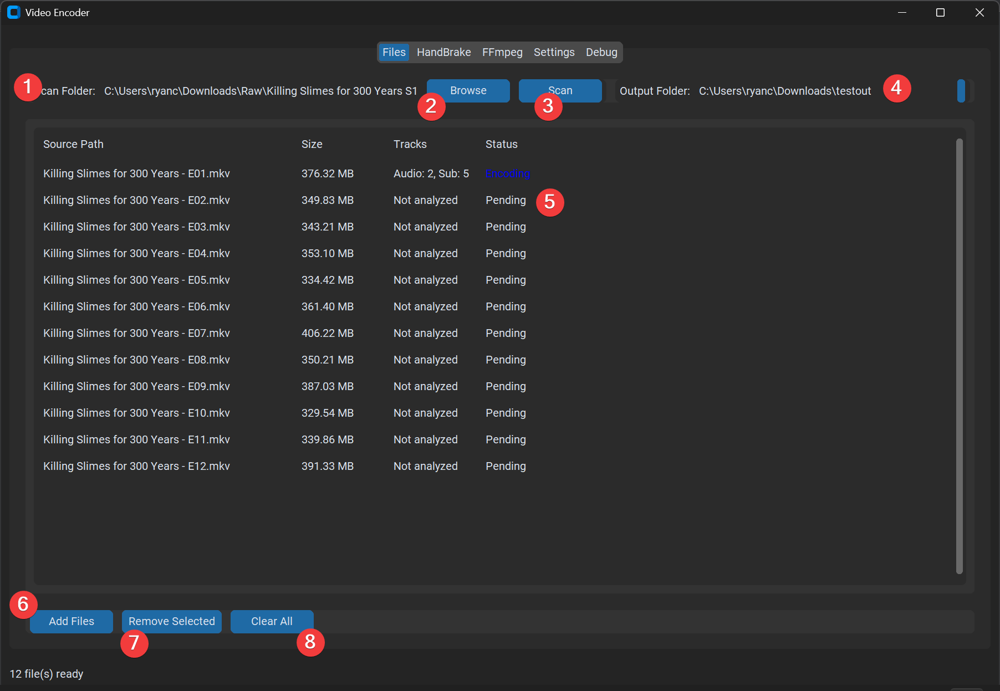
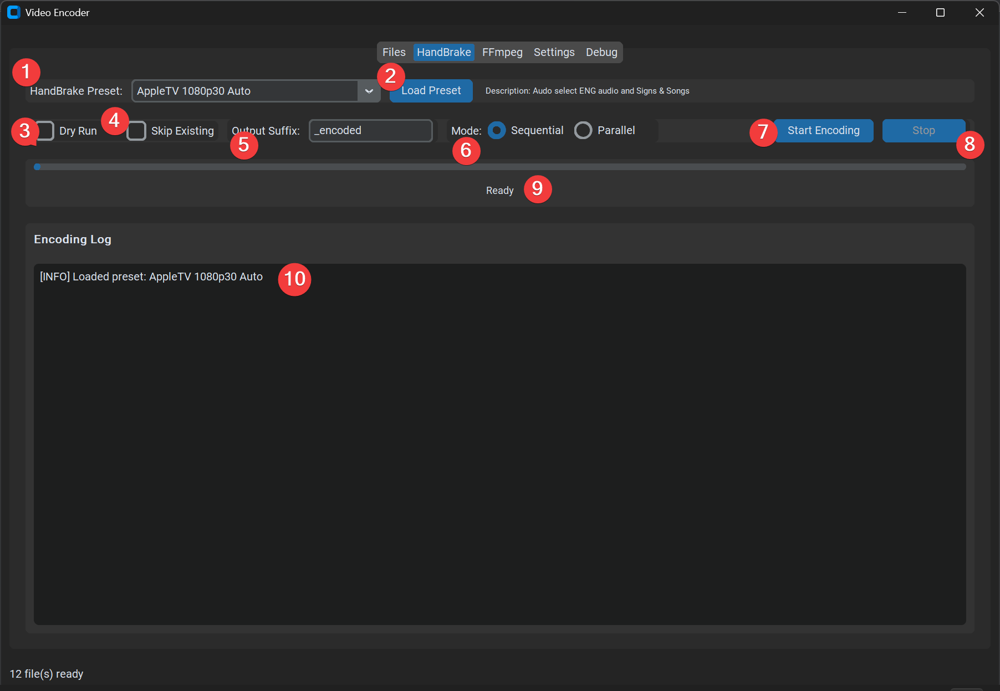
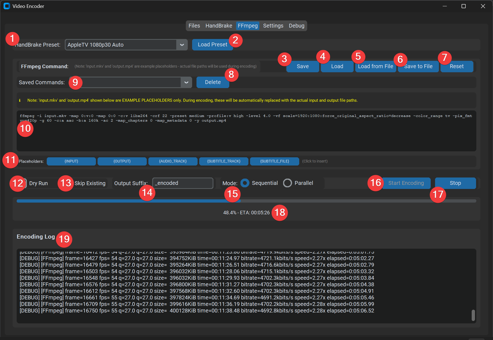
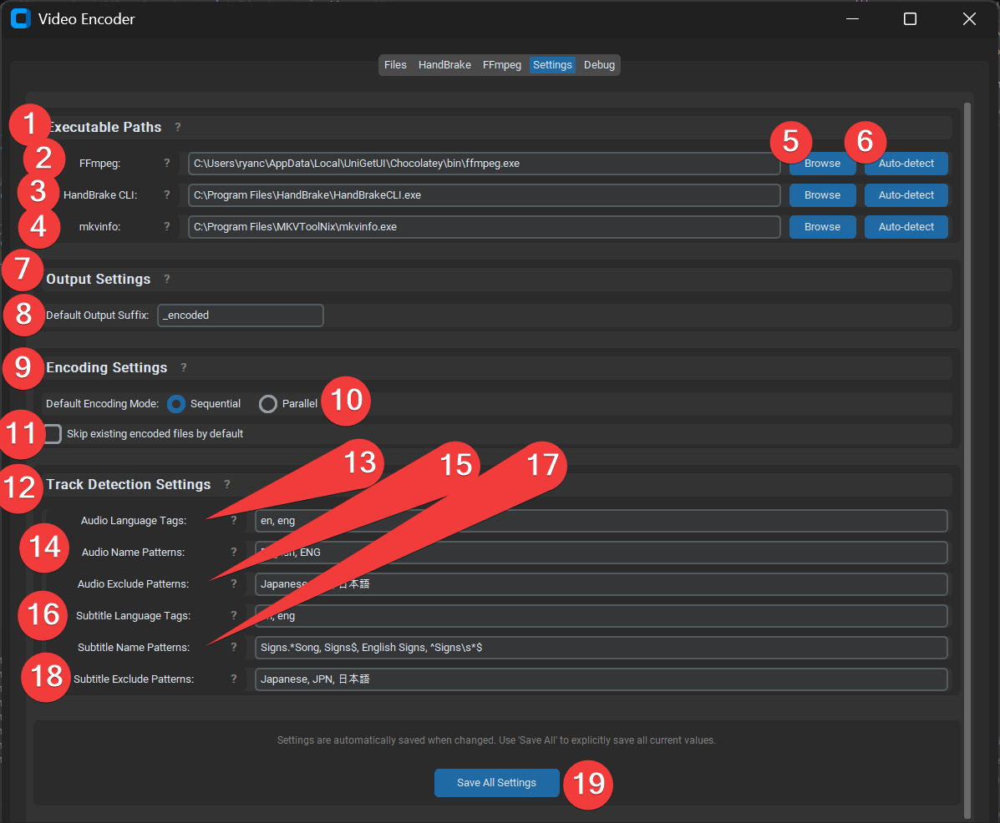
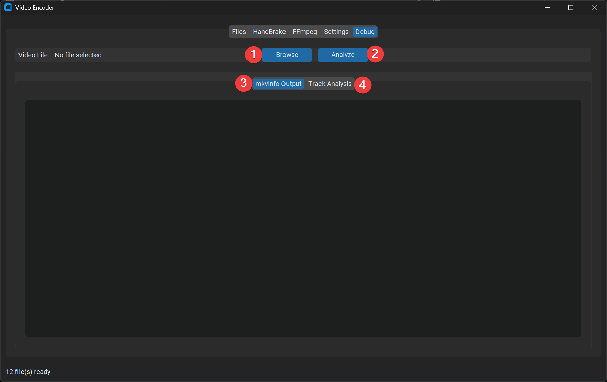

# Video Encoder GUI - Usage Guide

This guide provides step-by-step instructions for using the Video Encoder GUI application, with screenshots showing each interface element.

## Introduction

The Video Encoder GUI is a cross-platform application for encoding video files using HandBrake or FFmpeg. It features automatic track detection, preset management, and real-time progress tracking.

## Getting Started

### First-Time Setup

1. **Install Dependencies**: The application requires FFmpeg, HandBrake CLI, and MKVToolNix (mkvinfo). These can be:
   - Auto-detected if already installed
   - Installed via package managers (Chocolatey on Windows, Homebrew on macOS)
   - Manually configured in the Settings tab

2. **Configure Paths**: On first launch, go to the **Settings** tab and configure paths to:
   - FFmpeg executable
   - HandBrake CLI executable
   - mkvinfo executable (part of MKVToolNix)

3. **Load a Preset**: In either the **HandBrake** or **FFmpeg** tab, load a HandBrake preset JSON file to get started.

## Files Tab

The Files tab is where you manage the video files you want to encode.

### Step 1: Scan Folder
Select the folder containing your video files. The path will be displayed in the "Scan Folder:" field. You can also manually type or paste a path here.

### Step 2: Browse
Click the **Browse** button to open a file explorer dialog and select a folder containing your video files. This is useful for navigating to your video collection.

### Step 3: Scan
Click the **Scan** button to search the selected folder for video files. The application will recursively scan for common video formats (MKV, MP4, MOV, AVI, etc.) and add them to the file list.

### Step 4: Output Folder
Select the folder where encoded files will be saved. The path is displayed in the "Output Folder:" field. The application will preserve the folder structure from the scan folder in the output folder.

### Step 5: File List
View all discovered video files in the table. The list shows:
- **Source Path**: The filename of each video file
- **Size**: File size in MB
- **Tracks**: Number of audio and subtitle tracks (shown after analysis)
- **Status**: Current status (Pending, Encoding, Complete, Error, Skipped)

### Step 6: Add Files
Click **Add Files** to manually add individual video files to the list. This opens a file dialog where you can select one or more video files.

### Step 7: Remove Selected
Click **Remove Selected** to remove selected files from the list. (Note: File selection in the table is coming in a future update.)

### Step 8: Clear All
Click **Clear All** to remove all files from the list and start fresh.

## HandBrake Tab

The HandBrake tab allows you to encode videos using HandBrake CLI with JSON presets.

### Step 1: HandBrake Preset
Select a preset from the dropdown menu. This shows all previously loaded presets. If you haven't loaded any presets yet, the dropdown will be empty.

### Step 2: Load Preset
Click **Load Preset** to load a new HandBrake preset JSON file. This opens a file dialog where you can select a `.json` preset file. Once loaded, the preset will be saved and appear in the dropdown for future use.

### Step 3: Dry Run
Check the **Dry Run** checkbox to test the encoding process without actually encoding files. This is useful for verifying settings and commands before processing large batches of files.

### Step 4: Skip Existing
Check the **Skip Existing** checkbox to skip files that already have encoded versions in the output folder. This prevents re-encoding files that are already done.

### Step 5: Output Suffix
Enter a suffix to append to output filenames. For example, if the suffix is `_encoded` and your source file is `video.mkv`, the output will be `video_encoded.mp4`. The default is `_encoded`.

### Step 6: Mode
Select the encoding mode:
- **Sequential**: Encode one file at a time (safer, uses less resources)
- **Parallel**: Encode multiple files simultaneously (faster, uses more CPU/RAM)

### Step 7: Start Encoding
Click **Start Encoding** to begin processing all files in the file list. The button will be disabled during encoding.

### Step 8: Stop Encoding
Click **Stop** to cancel the current encoding operation. This will stop after the current file finishes encoding.

### Step 9: Progress
Monitor the encoding progress with the progress bar and status text. The status shows:
- Percentage complete
- Estimated time remaining (ETA)
- Current encoding speed

### Step 10: Encoding Log
View detailed encoding output in the **Encoding Log** section. This shows:
- File being processed
- Track analysis results
- HandBrake CLI output
- Any errors or warnings

## FFmpeg Tab

The FFmpeg tab allows you to encode videos using FFmpeg with full command editing capabilities.

### Step 1: HandBrake Preset
Select a preset from the dropdown menu. This will generate an FFmpeg command based on the selected preset's settings.

### Step 2: Load Preset
Click **Load Preset** to load a new HandBrake preset JSON file. The preset will be translated to an FFmpeg command automatically.

### Step 3: FFmpeg Command - Save
Click **Save** to save the current FFmpeg command with a custom name. You'll be prompted to enter a name for the command. Saved commands persist between sessions.

### Step 4: FFmpeg Command - Load
Click **Load** to load a previously saved command. This opens a dialog where you can select from your saved commands.

### Step 5: FFmpeg Command - Load from File
Click **Load from File** to load an FFmpeg command from a text file. This is useful for importing commands from external sources or backups.

### Step 6: FFmpeg Command - Save to File
Click **Save to File** to save the current FFmpeg command to a text file. This allows you to backup commands or share them with others.

### Step 7: FFmpeg Command - Reset
Click **Reset** to restore the command to the default generated from the currently selected preset. This discards any manual edits.

### Step 8: FFmpeg Command - Delete
Click **Delete** to remove the currently selected saved command from the dropdown. This permanently deletes the saved command.

### Step 9: FFmpeg Command - Saved Commands dropdown
Use the **Saved Commands** dropdown to quickly select and load a previously saved command. This is faster than using the Load button.

### Step 10: FFmpeg Command line
Edit the FFmpeg command directly in the large text area. You can:
- Modify parameters
- Add filters
- Change codec settings
- Write completely custom commands

**Note**: The `input.mkv` and `output.mp4` shown are example placeholders. During encoding, these will be automatically replaced with actual file paths.

### Step 11: FFmpeg Command placeholders
Click any of the placeholder buttons to insert dynamic placeholders into your command:
- **{INPUT}**: Replaced with the input file path
- **{OUTPUT}**: Replaced with the output file path
- **{AUDIO_TRACK}**: Replaced with the selected audio track number
- **{SUBTITLE_TRACK}**: Replaced with the selected subtitle track number
- **{SUBTITLE_FILE}**: Replaced with the path to an extracted subtitle file (if applicable)

### Step 12: Dry Run
Check the **Dry Run** checkbox to test the encoding process without actually encoding files. The command will be validated and displayed in the log, but no files will be processed.

### Step 13: Skip Existing
Check the **Skip Existing** checkbox to skip files that already have encoded versions in the output folder.

### Step 14: Output Suffix
Enter a suffix to append to output filenames. The default is `_encoded`.

### Step 15: Mode
Select the encoding mode:
- **Sequential**: Encode one file at a time
- **Parallel**: Encode multiple files simultaneously

### Step 16: Start Encoding
Click **Start Encoding** to begin processing all files in the file list using the current FFmpeg command.

### Step 17: Stop Encoding
Click **Stop** to cancel the current encoding operation.

### Step 18: Progress
Monitor the encoding progress with the progress bar and status text showing percentage, ETA, and encoding speed.

### Step 19: Encoding Log
View detailed FFmpeg output in the **Encoding Log** section. This shows:
- FFmpeg command being executed
- Frame-by-frame encoding progress
- Bitrate, speed, and quality metrics
- Any errors or warnings

## Settings Tab

The Settings tab allows you to configure all application settings, including executable paths, output options, encoding behavior, and track detection patterns.

### Step 1: Executable Paths
This section contains paths to external tools required by the application. Each path can be configured individually.

### Step 2: FFmpeg path
Enter the full path to the FFmpeg executable, or use the Browse/Auto-detect buttons to find it. FFmpeg is used for encoding when using the FFmpeg tab.

### Step 3: HandBrake CLI path
Enter the full path to the HandBrake CLI executable (HandBrakeCLI.exe on Windows). HandBrake is used for encoding when using the HandBrake tab.

### Step 4: mkvinfo path
Enter the full path to the mkvinfo executable (part of MKVToolNix). mkvinfo is used to analyze MKV files and detect audio/subtitle tracks.

### Step 5: Browse for path
Click **Browse** next to any executable path to manually select the executable file using a file dialog.

### Step 6: Auto Detect
Click **Auto-detect** next to any executable path to automatically search for and find the executable. The application will search common installation locations.

### Step 7: Output Settings
This section configures how output files are named and organized.

### Step 8: Default Output Suffix
Enter the default suffix that will be appended to output filenames. This value is used as the default in the HandBrake and FFmpeg tabs, but can be overridden per-encoding session.

### Step 9: Encoding Settings
This section controls the default behavior of the encoding process.

### Step 10: Default Encoding Mode
Select the default encoding mode:
- **Sequential**: Encode one file at a time (default)
- **Parallel**: Encode multiple files simultaneously

This setting is used as the default in the HandBrake and FFmpeg tabs.

### Step 11: Skip existing encoded files by default
Check this box to enable "Skip Existing" by default in the HandBrake and FFmpeg tabs. This prevents accidentally re-encoding files that are already done.

### Step 12: Track Detection Settings
This section defines rules for automatically detecting and selecting audio and subtitle tracks. The application uses these patterns to find English audio tracks and "Signs & Songs" subtitle tracks.

### Step 13: Audio Language Tags
Enter comma-separated language codes to match for English audio tracks (e.g., `en, eng`). The application will select audio tracks whose language tag matches or starts with these values.

### Step 14: Audio Name Patterns
Enter comma-separated regex patterns to match in audio track names (e.g., `English, ENG`). If a track name matches any pattern, it's considered English (unless excluded).

### Step 15: Audio Exclude Patterns
Enter comma-separated patterns to exclude from audio track selection (e.g., `Japanese, 日本語`). Tracks matching these patterns will be skipped even if they match language/name patterns.

### Step 16: Subtitle Language Tags
Enter comma-separated language codes to match for subtitle tracks (e.g., `en, eng`). Use `*` to match any language.

### Step 17: Subtitle Name Patterns
Enter comma-separated regex patterns to match in subtitle track names for "Signs & Songs" detection (e.g., `Signs.*Song, Signs$, English Signs`). These are regex patterns, so use `.*` for "any characters" and `$` for "end of string".

### Step 18: Subtitle Exclude Patterns
Enter comma-separated patterns to exclude from subtitle track selection (e.g., `Japanese, JPN, 日本語`). Tracks matching these patterns will be skipped even if they match language/name patterns.

### Step 19: Save All Settings
Click **Save All Settings** to explicitly save all current settings. Note that settings are automatically saved when changed, but this button ensures all values are saved at once.

**Help Icons**: Click the `?` icons next to section headers and settings for detailed help tooltips explaining each option.

## Debug Tab

The Debug tab allows you to analyze individual video files to understand track detection and troubleshoot issues.

### Step 1: Browse
Click **Browse** to select a video file for analysis. This opens a file dialog where you can choose any video file (MKV, MP4, MOV, AVI, etc.).

### Step 2: Analyze
Click **Analyze** to analyze the selected file. The application will:
- Run mkvinfo to get detailed file information
- Analyze all tracks (audio, video, subtitles)
- Determine which tracks match your detection patterns
- Show why tracks are or aren't being selected

### Step 3: mkvinfo Output
View the raw mkvinfo output in this tab. This shows the complete structure of the MKV file, including all tracks, their properties, language tags, and names. This is useful for understanding the file structure and debugging detection issues.

### Step 4: Track Analysis
View the track analysis results in this tab. This shows:
- Which audio track was selected (if any) and why
- Which subtitle track was selected (if any) and why
- All tracks found in the file with their properties
- For each track, whether it matches your detection patterns
- Your current detection settings for reference

Use this information to:
- Understand why specific tracks are selected
- Troubleshoot detection issues
- Adjust your detection patterns in Settings if needed

## Tips and Best Practices

1. **Test with Dry Run**: Always use Dry Run mode first to verify your settings before encoding large batches of files.

2. **Use the Debug Tab**: If tracks aren't being detected correctly, use the Debug tab to see exactly why. This helps you adjust your detection patterns.

3. **Save Your Commands**: Save frequently used FFmpeg commands with descriptive names for easy reuse.

4. **Check the Logs**: The encoding logs provide valuable information about the encoding process, including any warnings or errors.

5. **Preserve Folder Structure**: The application automatically preserves folder structure from your scan folder to your output folder, making it easy to organize large collections.

6. **Skip Existing Files**: Enable "Skip Existing" to avoid re-encoding files that are already done, especially useful when resuming interrupted encoding sessions.

7. **Sequential vs Parallel**: Use Sequential mode for stability, or Parallel mode for speed when you have sufficient CPU and RAM resources.

